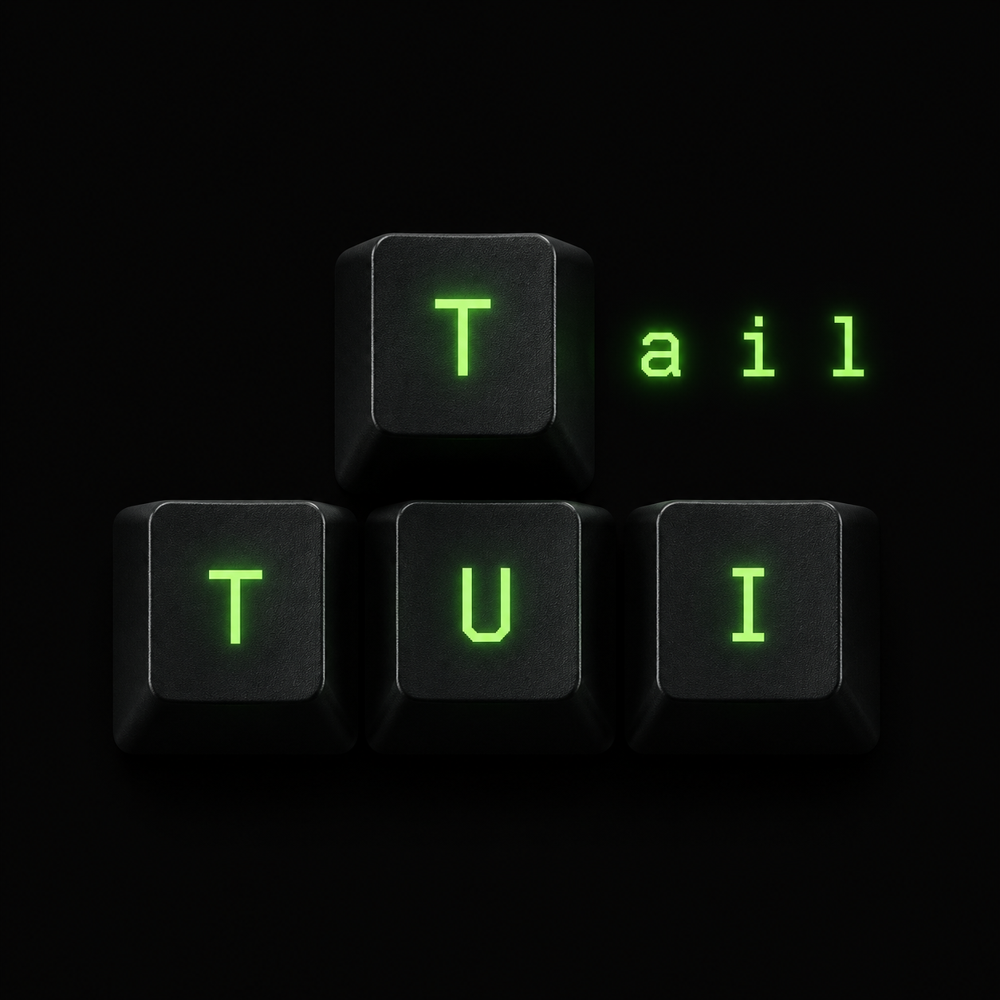
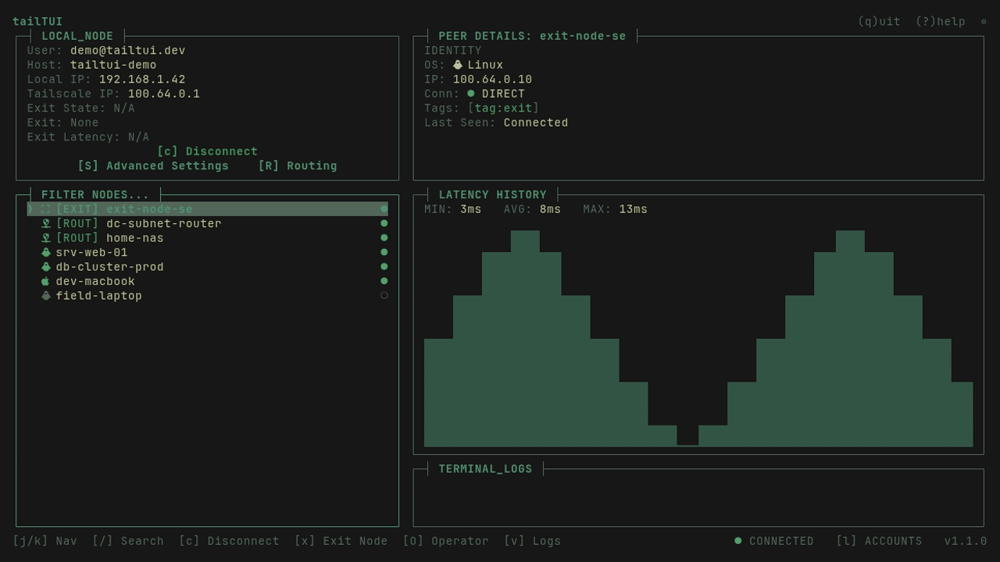

# tailTUI
*A brutalist, keyboard-centric terminal user interface for Tailscale.*

`tailTUI` is a fast, dense, single-screen control panel for your tailnet. It
wraps the `tailscale` CLI in a sharp, no-nonsense TUI built on the
[Charmbracelet](https://charm.sh) stack — so you can see your whole network,
ping peers, switch accounts, and flip your connection without ever leaving the
terminal.



## Why tailTUI?

The official `tailscale` CLI is excellent, but managing a large tailnet means
re-running `status`, squinting at JSON, and copy-pasting IPs. `tailTUI` is built
for the opposite workflow:

- **Built for speed and flow-state.** Everything is one keystroke away. No menus,
  no mouse, no context switching. The whole network is on one screen, refreshed
  live.
- **At home in a tiling window manager.** A sharp, flush, single-line-bordered
  layout that snaps cleanly into any pane and stays flush at any size — no
  wasted space, no wrapping, no rounded-corner fluff.
- **Never leaves the terminal.** Auth flows, operator setup, and login prompts
  drop you to the shell only when *they* need to (to paste an auth URL), then
  restore the UI automatically.

## What's New in v1.1.0

tailTUI grew from a read-only dashboard into a full configuration tool:

- **Advanced Settings modal (`S`).** Toggle live local-node preferences —
  accept-routes, exit-node LAN access, Tailscale SSH, MagicDNS, and shields-up —
  each driving the real `tailscale set --<flag>`, with optimistic updates that
  reconcile against the daemon. Operator setup (`O`) is built in. The settings
  hotkey moved to uppercase `S`, keeping the lowercase keys free (search stays on
  `/`).
- **Routing Management (`R`).** Stage advertised exit-node and subnet-route
  changes locally: add routes through a CIDR field validated with
  `net.ParseCIDR`, remove them, or pop a just-deleted route back via a smart
  pre-fill **undo** (`d` then `a`).
- **The "Command Room."** Before anything is applied, a transparent confirmation
  overlay shows the exact `tailscale set …` command, so there's never a hidden
  mutation — plus a reminder that routes/exit nodes still need Admin Console
  approval.
- **Clipboard integration.** Copy the generated command straight to the system
  clipboard (`c`), asynchronously so the UI never blocks.

## Features

- **Live, multi-row latency graphing.** Select any peer and watch a real-time
  vertical bar chart of round-trip latency (`tailscale ping`), color-graded by
  severity, with live MIN / AVG / MAX. The chart grows to fill the pane.
- **fzf-style fuzzy search.** Press `/` and type to instantly filter massive
  tailnets by hostname or tag. Navigate the results *while typing* with the
  arrows or `Ctrl+j`/`Ctrl+k`; `Enter`/`Esc` to apply, `Esc` again to clear.
- **Live, color-coded log tailing.** A capped in-app event log records every
  action and the real `tailscaled` error output, syntax-highlighted by level
  (`ERROR` red, `INFO` green, `WARN` yellow). Tail it at the bottom or pop the
  full scrollable history with `v`.
- **Fast user switching.** Manage your Tailscale profiles right in the UI
  (`l`) — switch, add a login, remove, or log out, all live via
  `tailscale switch`.
- **Advanced settings, no flags to memorize.** Press `S` for a master/detail
  modal that reads your live local-node preferences (`tailscale debug prefs`)
  and toggles them with `Space` — Accept Subnet Routes, Allow LAN Access, Run
  Tailscale SSH, Accept MagicDNS, and Shields Up — each driving the real
  `tailscale set --<flag>`, with the exact command shown alongside its
  description.
- **Interactive operator & connection control.** Toggle your tailnet connection
  (`c` → `tailscale up`/`down`) or fix operator permissions (`O` →
  `sudo tailscale set --operator`) with the auth/password prompt handled
  inline.
- **Routing management.** Press `R` for a routing overlay that reads your live
  advertised state (`tailscale debug prefs`) — exit-node advertising plus every
  advertised subnet route. Toggle the exit-node flag (`Space`), remove a route
  (`d`), or add one through a CIDR text field (`a`, validated with
  `net.ParseCIDR`) — and since a just-deleted route pre-fills the add field, a
  `d` then `a` is a quick undo/edit. Press `Enter` to open a **Command Room**
  that shows the exact `tailscale set` command before it runs, copies it to your
  clipboard (`c`), and reminds you that routes/exit nodes still need Admin
  Console approval.
- **Exit nodes & subnet routes at a glance.** One-key exit-node toggling (`x`),
  advertised-route inspection (`e`), and a priority-sorted node list (exit
  nodes → subnet routers → online → offline). The LOCAL_NODE panel's **Exit
  State** reads the real-time route status — `DIRECT` or `RELAY` — of the
  *active* exit node connection (the peer all traffic is routed through), or
  `N/A` when no exit node is active.

## Installation

`tailTUI` is a single statically-compiled Go binary with **no runtime
dependencies beyond the standard `tailscale` CLI**. It ships as one
self-contained executable and runs identically on **any modern Linux
distribution** — Ubuntu, Debian, Fedora, Arch, NixOS, openSUSE, Alpine — with
no packaging tweaks, service hooks, or distro-specific patches. If
`tailscale` is on your `PATH` and the daemon is running, `tailTUI` works.

To install the latest version directly via Go, run:

```bash
go install github.com/Phundahl/tailtui@latest
```

Or build from source:

```bash
git clone https://github.com/Phundahl/tailtui
cd tailtui
go build -o tailtui .
./tailtui
```

**Requirements:** Go 1.26+ (to build), a working
[Tailscale](https://tailscale.com) install (the `tailscale` CLI on your
`PATH`, daemon running), and a terminal with a
[Nerd Font](https://www.nerdfonts.com/) for the node glyphs. TrueColor
support is recommended but not required — the theme degrades gracefully to
ANSI on 256-color terminals.

> **Trying it out without a Tailnet?** Set `TAILTUI_MOCK=1` and `tailTUI`
> runs against an in-memory anonymized fixture (7 fictional nodes, 2 mock
> accounts, a synthetic live latency wave) without ever invoking the real
> `tailscale` CLI — handy for screenshots, contributor demos, and the bundled
> VHS recording (`vhs demo.tape`):
> ```bash
> TAILTUI_MOCK=1 go run .
> ```

## Keybindings

| Key | Action |
| :-- | :-- |
| `j` / `k`, ↑ / ↓ | Navigate the peer list (wraps at top/bottom) |
| `/` | Search / fuzzy-filter. While typing: ↑↓ or `Ctrl+j`/`Ctrl+k` navigate |
| `Enter` / `Esc` | Apply the filter (blur the box); `Esc` again clears it |
| `c` | Connect / disconnect the local node (`tailscale up`/`down`) |
| `x` | Toggle the highlighted peer as the active exit node (exit-capable peers only) |
| `e` | Expand a subnet router's advertised routes |
| `v` | Open / close the full event-log overlay |
| `l` | Account management — switch · add · remove · logout |
| `S` | Advanced settings — toggle local prefs (`Space`) via `tailscale set` |
| `R` | Routing management — toggle exit-node (`Space`), add (`a`) / remove (`d`) routes; `Enter` opens the Command Room to preview, copy, and apply `tailscale set` |
| `O` | Operator setup (`sudo tailscale set --operator=$USER`) |
| `?` | Toggle the help overlay |
| `q` / `Ctrl+c` | Quit |

## Permissions & sudo

`tailTUI` keeps everyday flow uninterrupted by asking for elevation only when
the underlying Tailscale call genuinely requires it:

- **Daily monitoring & node operations** — the live status poll, latency
  graph, exit-node toggle (`x`), advanced settings (`S`), and routing
  management (`R`, including the Command Room apply) only need the Tailscale
  **operator** role on the local node. Run `[O]` once to grant it
  (`sudo tailscale set --operator=$USER`, the only sudo prompt for these
  flows); after that, daily use never asks for a password.
- **Account Management is different** — every action inside the `[l]` modal
  (**add `a`**, **switch `Enter`**, **remove `d`**, **logout `l`**)
  temporarily suspends the TUI and runs the underlying `tailscale` command
  through `sudo`. On Linux the local profile store is root-owned, so these
  calls fail with `Access denied: profiles access denied` without elevation
  regardless of the operator role. Your terminal stays interactive
  throughout: type your sudo password (and, for `add`, complete the
  `tailscale login` auth URL), and the TUI restores itself automatically when
  the command finishes.

If `tailTUI` is launched from an unprivileged session and the daemon refuses
even the background profile-list read, the Account Management modal renders
**“Profile store locked. Run tailTUI with sudo to view and manage accounts.”**
instead of an empty list, and the recurring permission error is suppressed
from the log ring rather than spammed on every refresh.

## Theming & aesthetic (Omarchy roots)

Out of the box, `tailTUI` ships with a hyper-minimalist, border-conscious
**"Matrix Core"** palette — a neon-green-on-near-black look built around sharp
single-line borders, an opaque tonal surface for overlays, and no
rounded-corner fluff. It's intentionally translucent-friendly: with a
slightly transparent terminal it layers cleanly over a tiling desktop
without the boxed-in feel that boxy TUIs get.

The aesthetic was designed in concert with the minimalist
**[Omarchy](https://omarchy.org)** desktop (Hyprland, transparent terminals,
a unified accent color), and when Omarchy is present `tailTUI`
**automatically adopts your system theme** by reading
`~/.config/omarchy/current/theme/colors.toml` — so it tracks your wallpaper
and accent without configuration.

**The Omarchy binding is purely cosmetic, not a requirement.** `tailTUI` is a
stock [Bubble Tea](https://github.com/charmbracelet/bubbletea) program, so
the default "Matrix Core" palette renders beautifully on any modern desktop
and in any modern terminal emulator — **Alacritty, Kitty, Ghostty, WezTerm,
Foot, GNOME Terminal, Konsole, iTerm2, Windows Terminal**, and so on. Point
`TAILTUI_THEME` at any compatible `colors.toml` (the Omarchy schema —
`accent`, `foreground`, `background`, `color0`–`color15`) to override the
palette without touching the binary. All colors are TrueColor and degrade
gracefully to the nearest ANSI color on terminals without 24-bit support.

## Status

`tailTUI` is in active development. The node list, details, latency graphs,
routes, logs, exit-node control, connection toggle, account management, and
advanced preference toggles are all wired to live Tailscale data. The routing
management overlay reads live advertised-route state, stages exit-node /
subnet-route edits, and applies them through a transparent "Command Room"
confirmation (`tailscale set`, with clipboard copy). See the Roadmap for what's
next.

## Roadmap

Parked, upcoming features for future development cycles:

- **Tailscale Serve & Funnel management.** Visual port forwarding to securely
  expose local services to the tailnet (Serve) or the public internet (Funnel),
  managed from the same keyboard-driven overlays.
- **Connection diagnostics.** A deep dive into peer connection health —
  surfacing whether traffic is taking a DERP relay or a direct path, with the
  signals needed to debug a flaky link.
- **ACL tag management.** Handling machine identities and `--advertise-tags` for
  production server environments, so tagged nodes can be provisioned and audited
  without leaving the TUI.

Smaller parked items: in-UI Tailscale SSH and ping-as-action.

## Acknowledgments

This project was designed and directed by Phundahl, with AI-assisted code
generation (Claude / Gemini) used to rapidly prototype and build the Bubble Tea
interface.

## License

Released under the [MIT License](LICENSE). © 2026 Phundahl.
